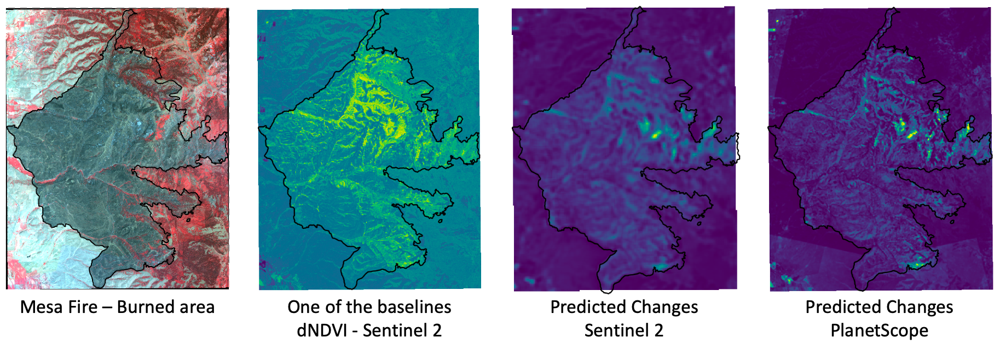

# FireCLR-Wildfires

Official code for 🔥 Unsupervised Wildfire Change Detection based on Contrastive Learning 🔥. Work conducted at the <a href="https://frontierdevelopmentlab.org/fdl-2022">FDL USA 2022</a>.

<table><tr>
  <td>
    <b>FireCLR</b>
  </td>  
  <td>
    <em> A self-supervised learning model was developed based on a popular contrastive learning architecture named SimCLR. The model takes 4-band multispectral imagery (blue, green, red, and near-infrared) to detect the changes caused by wildfires using the distance maps calculated from the models' representation layer. The downstream tasks at the Mesa fire in Idaho show that the FireCLR outperforms baselines. At this repository, we release the scripts to show how to use the model and reproduce the requirements. We also release the annotated dataset of burned severity and training and validation datasets at the Mesa fire from Sentinel-2. Work conducted at the <a href="https://frontierdevelopmentlab.org/fdl-2022">FDL 2022</a>.
    </em>
</td>  
</tr></table>
<p align="center">
<p align="center">
  <a href="https://arxiv.org/abs/2211.14654">NeurIPS workshop paper</a> •
  <a href="https://colab.research.google.com/drive/1-VHLPVyoXo8yXEAgNbR9pphAVB8nly1A?usp=sharing">Quick Colab Example  </a>
</p>


---

## Unsupervised Wildfire Change Detection based on Contrastive Learning

<p align="center">
    
</p>

> **Abstract:** The accurate characterization of the severity of the wildfire event strongly contributes to the characterization of the fuel conditions in fire-prone areas, and provides valuable information for disaster response. The aim of this study is to develop an autonomous system built on top of high-resolution multispectral satellite imagery, with an advanced deep learning method for detecting burned area change. This work proposes an initial exploration of using an unsupervised model for feature extraction in wildfire scenarios. It is based on the contrastive learning technique _SimCLR_, which is trained to minimize the cosine distance between augmentations of images. The distance between encoded images can also be used for change detection. We propose changes to this method that allows it to be used for unsupervised burned area detection and following downstream tasks. We show that our proposed method outperforms the tested baseline approaches.

### Dataset

<p align="center">
    
</p>

**Training Dataset**

|                                   |          Sentinel-2          |          PlanetScope           |
| :-------------------------------- | :--------------------------: | :----------------------------: |
| Mesa (2018, Idaho)                |           8 images           |               X                |
| East Troublesome (2020, Colorado) |              X               |           17 images            |
| McFarland (2021, California)      |              X               |           26 images            |
| Total instances                   | 941,190 tiles<br />(32,32,4) | 4,382,607 tiles<br />(32,32,4) |

**Validation Dataset**

|                    |                          Sentinel-2                          |                   PlanetScope                   |
| :----------------- | :----------------------------------------------------------: | :---------------------------------------------: |
| Mesa (2018, Idaho) | 2018-07-26 (prefire)<br />2018-08-15 (postfire)<br />**[not included in training]** | 2018-07-26 (prefire)<br />2018-08-15 (postfire) |

### Code examples

**Install**

```bash
# prep environment
conda env create -f environment.yml
conda activate myenv
```

**Training**

The training process is shown in the two notebooks that employ [Sentinel-2](Mesa_FireCLR_Training_S2.ipynb) and [PlanetScope](Mesa_FireCLR_Training_PS.ipynb) separately. To reproduce the training process, we provide the Sentinel-2 training dataset, which can be downloaded from [here](https://drive.google.com/file/d/1X1tRpp2oE-0fCoe8qhpfflgm7uk14gUD/view?usp=sharing). And the training dataset needs to be processed into tiles in a size of *(32,32,4)* based on this [notebook](notebooks/preprocessing/Preparing_Training_Data_S2.ipynb).

**Validation (Downstream tasks)**

The scripts of the validation for the downstream tasks on detecting the changes caused by the Mesa fire in Idaho are also provided ([Sentinel-2](FireCLR_Downstream_CD_S2.ipynb), [PlanetScope](FireCLR_Downstream_CD_PS.ipynb)). The Sentinel-2 validation dataset is available at [here](https://drive.google.com/file/d/1fTEp5fsLzk_af7XhGXT2y90C35Zj_5ko/view?usp=sharing). Similar to the training process, the validation dataset is provided in a full scene of the Mesa fire. You will need to preprocess it into tiles using this [notebook](notebooks/preprocessing/Preparing_Val_Data.ipynb) before inputting into the trained model.

**Pre-trained models**

We provided our pre-trained models based on the Sentinel-2 and PlanetScope at [here](https://drive.google.com/drive/folders/12Tpzs2poCqG0aTOYpQzT8QbPhB78DNRd?usp=sharing) if you would like to use them to reproduce the validation or transfer it on applying to other downstream tasks.

**Inference**

To start using our models for inference, it's best to start with the prepared notebooks ([Sentinel-2](notebooks/downstream_task/S2_Downstream_validation.ipynb), [PlanetScope](notebooks/downstream_task/PS_Downstream_validation.ipynb)), which employs our annotated dataset for the burned severity and evaluates the [predicted cosine distance maps](https://drive.google.com/drive/folders/1m42dTLjbNRrc7-jnUQ7-jXSt-XDb99KY?usp=sharing) from the pre-trained models based on Sentinel-2 and PlanetScope. The Shapefiles of the manually annotated labels are available at [here](https://drive.google.com/drive/folders/1vIW3PNQND4fN1hZleIhNlZuAyUtBfPEa?usp=sharing).

### Demo

Indication of the severely burned areas (white/black ash) at the central (slightly forward northeast) of the Mesa fire based on the outputs of the model trained on the PlanetScope datasets. The pixels in yellow have a larger cosine distance between the two representation layers (vectors in the latent spaces) from the pre and post Mesa fire multispectral images.

<p align="center">
<em>
	Prefire - Postfire - Predicted changes based on the distance map
</em>
<p align="center">
    
</p>


## Citation

If you find FireCLR useful in your research, please consider citing the following paper:
```latex
@inproceedings{fireclr2022,
	title = {Unsupervised Wildfire Change Detection based on Contrastive Learning},
  author = {Zhang, Beichen and Wang, Huiqi and Alabri, Amani and Bot, Karol and McCall, Cole and Hamilton, Dale and Růžička, Vít},
  booktitle = {Artificial {Intelligence} for {Humanitarian} {Assistance} and {Disaster} {Response} {Workshop}, 36th {Conference} on {Neural} {Information} {Processing} {Systems} ({NeurIPS} 2022), {New Orleans}, {USA}},
  month = nov,
  year = {2022},
  url = {https://arxiv.org/abs/2211.14654},
  doi = {10.48550/ARXIV.2211.14654}
}
```
